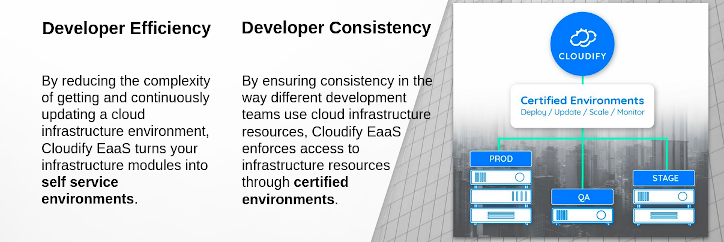

# Cloudify & Open Source

[Cloudify](https://cloudify.co/) is an open source orchestration platform that helps DevOps teams structure their environments and enable developer self-service. 

Cloudify Environment as a Service (EaaS) enables engineers to turn their existing Kubernetes, Helm, Terraform, CloudFormation, Azure ARM, and Ansible modules into self service development and production environments. 

Environments can be as simple as a developer’s test VM running in a private cloud, or as complex as a full production deployment across multiple cloud providers. Environments consist of many components: infrastructure resources, shared services, applications, supporting tools, and more. Cloudify combines all of these resources into a single environment, allowing developers to seamlessly orchestrate and manage them in a self-service manner.

Environments can be deployed and managed in a single click via Cloudify’s UI, or they can be integrated into existing CI/CD tools via the Cloudify API and associated integrations (Jenkins, GitHub Actions, etc.). Organizations with robust ITSM platforms can also integrate Cloudify into their existing workflows to automatically handle IT requests. For example: a ServiceNow request can automatically trigger the provisioning of a new VM, complete with running applications, for a developer.

## By developers, for developers

## Cloudify Open Source Contributions

Cloudify actively contributes to open source in several ways:

* The Cloudify manager and all supporting infrastructure, such as the UI, is open source.
* The Cloudify architecture is pluggable, and we make all of our officially supported plugins open source. Many customers have even built their own plugins, which are written in Python.
* Cloudify provides an open source community of blueprints and actively accepts contributions from the community.
* Cloudify designed and maintains the Wagon packaging format for bundling Python wheels together for offline installation.
