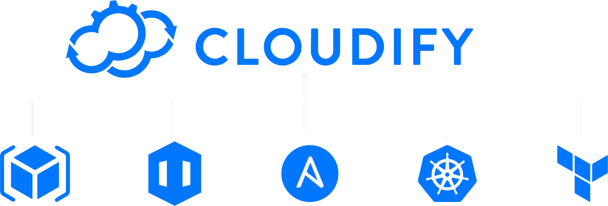

# Cloudify & Open Source

Cloudify is an Open-Source orchestration platform that helps DevOps teams structure their environments and enable developer self-service.

Cloudify Environment as a Service (EaaS) enables engineers to turn their existing Kubernetes, Helm, Terraform, etc. into self-service development and production environments.

When asked why they utilize Open-Source as the main product’s vertical, Nati Shalom, CTO & Founder of Cloudify, replied:
* **Disruption** - Open-Source is a very effective tool for a startup to disrupt a market that is highly dominated by non-open source incumbent players. In our case that was VMware or the public cloud providers (See [Summit 2017: A David vs. Goliath Tale of Triumph](https://www.reversim.com/2018/02/summit-2017-david-vs-goliath-tale-of.html)).

* **Win large customers** - Open-Source allows large enterprises to adopt software solutions from small startups by reducing the lock-in risk.

* **DevOps friendly** - The DevOps automation space is often built out of integration of many tools (a tool chain). The integration between Open-Source tools is often much easier than non Open-Source tools, which is why most DevOps tools take the Open-Source route.

* **Ideology** - We believe that Open-Source forces companies to write high quality software simply since everyone can see the code. It also helps to drive a more collaborative and transparent company culture. 

Cloudify actively contributes to Open-Source in several ways:

* The Cloudify manager and all supporting infrastructure, such as the UI, is [Open-Source.](https://github.com/cloudify-cosmo)

* The Cloudify architecture is pluggable. The Open-Source Cloudify manager can be further extended through the development of plugins. Cloudify open sources and [releases](https://github.com/orgs/cloudify-cosmo/repositories?q=plugin&type=all&language=&sort=) all of their officially supported plugins, which are written in Python. Users can also develop their own plugins and extend the resource library, the UI, and the automation language itself.

* Cloudify provides an [Open-Source community](https://github.com/cloudify-community/) of blueprints and actively [accepts contributions](https://github.com/cloudify-community/contributing) of both plugins and blueprints from their community of users.

* Cloudify designed and maintains the [Wagon packaging format](https://github.com/cloudify-cosmo/wagon) for bundling Python wheels together for offline installation. Wagon provides the ability to combine multiple Python wheels into a single archive that can be distributed in offline environments. While originally designed to work with Cloudify’s plugin architecture, Wagon packages can be used in any environment where distributing combined sets of offline Python wheels is necessary, such as in secure or limited environments.
